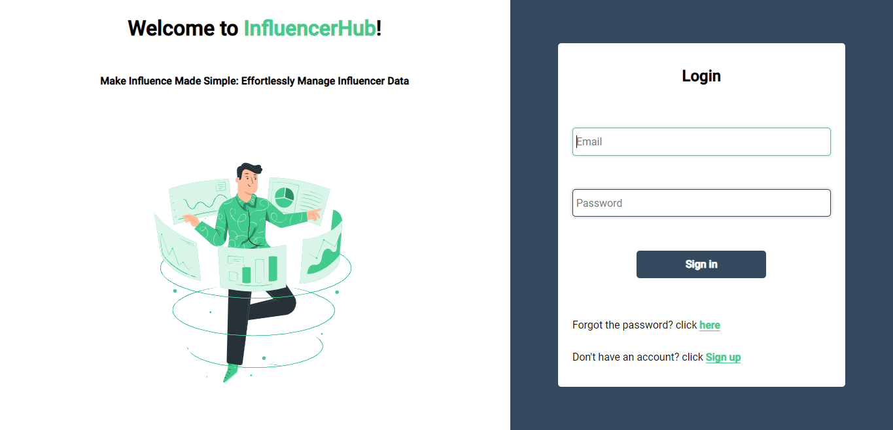
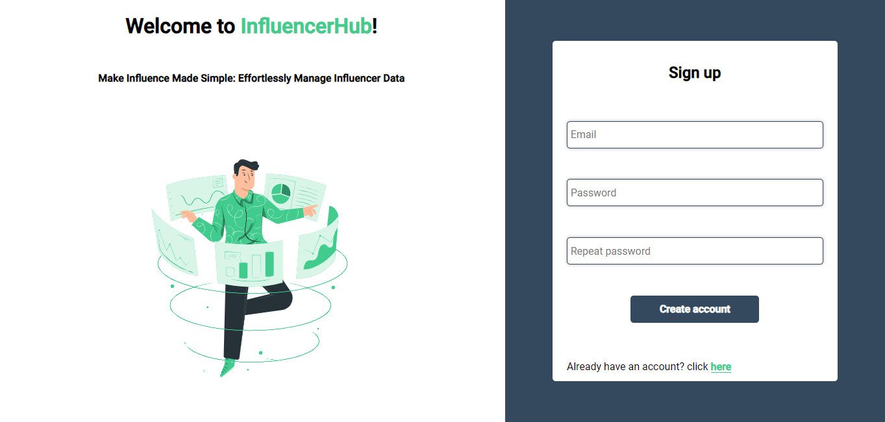
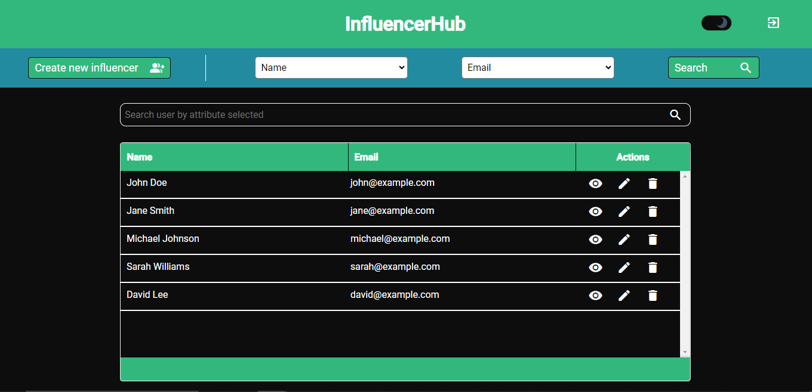
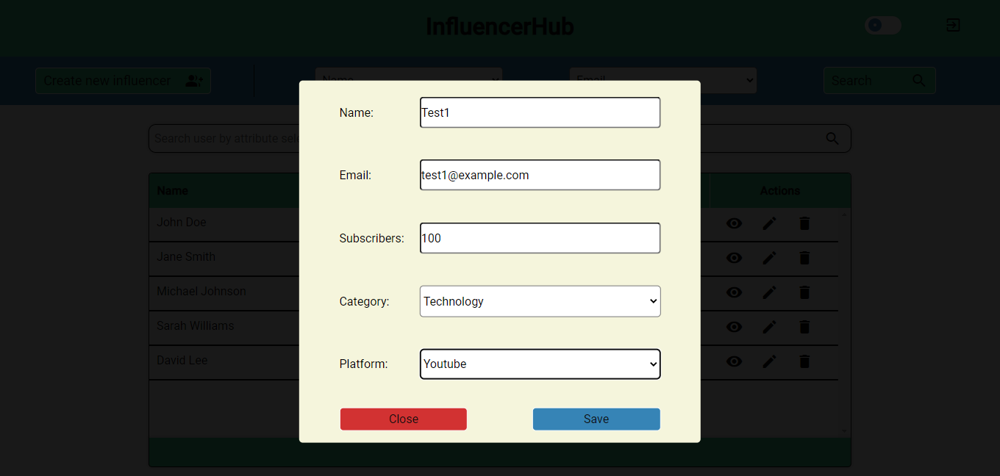
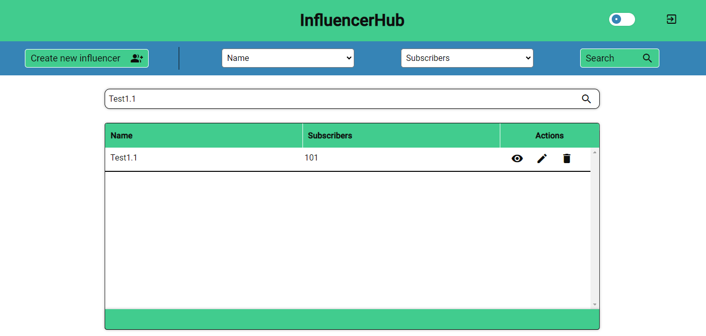
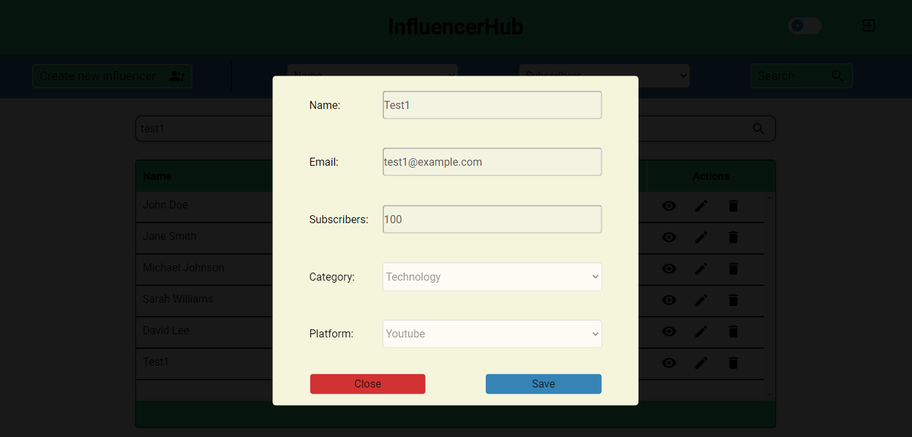
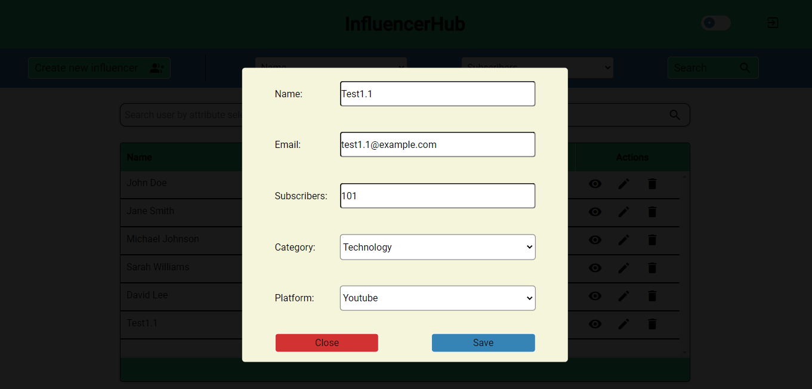
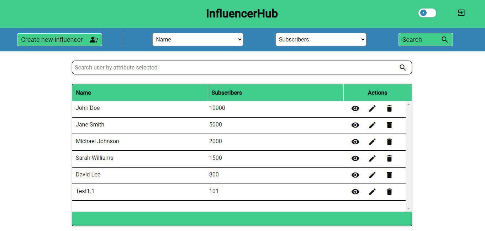

# InfluencerHub

### InfluencerHub is a full-stack web application built using Angular in the frontend and Node.js with MySQL in the backend. 
It provides CRUD (Create, Read, Update, Delete) operations for managing influencers' information.

## Backend Setup

1. Navigate to the backend folder and run the following command to install dependencies:
```npm install```

2. Open MySQL Workbench and connect to your local instance. Run the following commands to set up the necessary 
schemas and tables:
``` 
-- Create a schema to store tables
CREATE SCHEMA influencerhub;

-- Use the schema
USE influencerhub;

-- Create the 'users' table
CREATE TABLE users (
  id INT PRIMARY KEY AUTO_INCREMENT,
  name VARCHAR(255) NOT NULL,
  email VARCHAR(255) NOT NULL,
  subscribers INT NOT NULL,
  category VARCHAR(255) CHECK (category IN (
    'Review', 'Vlog', 'Gaming', 'Tutorial', 'Comedy', 'Beauty', 'Fashion',
    'Food', 'Travel', 'Technology', 'Music', 'Sports', 'Fitness', 'Education', 'Lifestyle'
  )),
  platform VARCHAR(255) CHECK (platform IN (
    'Youtube', 'Facebook', 'Instagram', 'Tiktok', 'Twitter', 'Twitch'
  ))
);

-- Insert values into the 'users' table
INSERT INTO users (name, email, subscribers, category, platform) VALUES
  ('John Doe', 'john@example.com', 10000, 'Review', 'Youtube'),
  ('Jane Smith', 'jane@example.com', 5000, 'Vlog', 'Instagram'),
  ('Michael Johnson', 'michael@example.com', 2000, 'Gaming', 'Twitch'),
  ('Sarah Williams', 'sarah@example.com', 1500, 'Food', 'Facebook'),
  ('David Lee', 'david@example.com', 800, 'Music', 'Twitter');

-- Create the 'accounts' table
CREATE TABLE accounts (
  id INT PRIMARY KEY AUTO_INCREMENT,
  email VARCHAR(255) UNIQUE,
  password VARCHAR(255) NOT NULL,
  role VARCHAR(255) NOT NULL DEFAULT 'User' CHECK (role IN ('Admin', 'User'))
);

-- Insert values into the 'accounts' table
INSERT INTO accounts (email, password, role)
VALUES ('user1@example.com', 'user123', 'User');

INSERT INTO accounts (email, password, role)
VALUES ('user2@example.com', 'user321', 'User');

INSERT INTO accounts (email, password)
VALUES ('user3@example.com', 'user231');
```
3. Open the server.js file in the backend folder and update the MySQL connection (__details according to your local setup.__)

4. Start the backend server by running the following command:
   ```npm start ```
   The server will run on port (__3006__).

## Frontend Setup

1. Open a new terminal window and navigate to the frontend/dashboard directory.

2. Run the following command to install the frontend dependencies:
   ```npm start ```
   
3. Once the dependencies are installed, start the frontend application by running:
    ```ng serve ```
   The application will be available at  (__http://localhost:4200__)

## Usage

This web application was designed to manage influencer data using an Angular framework, coupled with node.js and SQL. It features a versatile search interface allowing users to filter influencers based on one or two attributes or through a dynamic input field.

## Application images

### Important: All data retrieved in the application was added using the SQL code mentioned before.

<span>The landing page is where the user can log in (if they already have an account) or create a new one. In the case that the user has an account, they need to fill in the email and password fields.</span>



<span>If the user does not have an account, they need to click on the 'Sign up' button to be redirected to the form for creating a new account. The image below shows the create account form. Once the user fills in the fields and clicks on the 'Create account' button, they will be redirected back to the login page again</span>



<span>Once the user logs in, they will be redirected to the home page. The home page consists of a header (containing the application name, a switch theme button, and a logout button), a search options bar (with a 'Create a new influencer' button, two select fields containing all user's attributes, and a search button), and a table of influencers.</span>


<span>This is how the application will be displayed when the user uses the button to change the theme, in this case, the dark theme. </span>



<span>Observation: All other images in this readme will use the light theme.</span>

<span>If the user desires to create a new influencer, it is necessary to click on the 'Create New Influencer' button, which will pop up a form to be filled with information about the new influencer.</span>



<span>Once a new user is created, it will be visible in the influencer's table.</span>


<span>As mentioned previously, there are two select fields that contain all influencer's attributes. These selects have the function of creating a dynamic search among influencers, returning only the selected attribute in the search moment to the table. In example below 
 are selected attributes "Name" and "Platform".</span>


<span>Here's another search with "Email" and "Subscribers" selected.</span>


<span>The user may search for an influencer by input field, but there is a point, the search will be executed based on attributes selected on the select fields. if the user fills the input with the text "test" and the attributes "Name" and "Email" are selected, the table will filter and return influencers that have name or email like "test".</span>



<span>There are some actions that the user may do on the table (table's row that represents one specific influencer), such as seeing all information about this influencer, editing this influencer, and deleting this influencer.</span>

<span>Here is some actions examples:</span>

<ul>
  <li>See influencer's data (Edit disabled): </li>
  <li>Edit an influencer on the form (Edit abled): </li>
  <li>Edit an influencer on the table: </li>
  <li>Delete the influencer created: </li>
</ul>

<span>The application is in development, so soon will come new features and improvements.</span>

<span>Feel free to explore and manage influencer information using InfluencerHub!</span>


